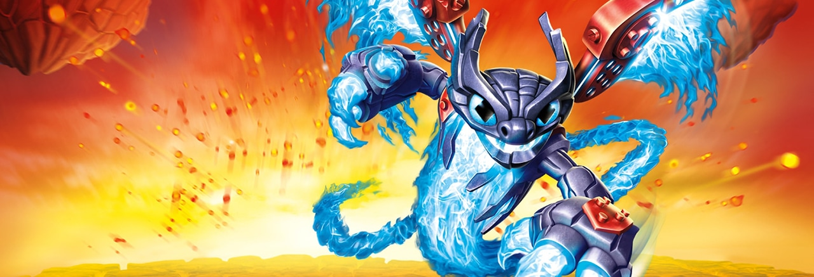

<p align="center">
  
</p>

<h1 align="center">Dè PerPortal</h1>
<p align="center">
  <a href="https://github.com/Il-Mazu/De-PerPortal/releases/latest">Download for Windows</a> ·
  <a href="#download-and-setup">Get started</a> ·
  <a href="#controls">Controls</a> ·
  <a href="https://github.com/Il-Mazu/De-PerPortal/issues">Report an issue</a>
</p>

A portable Windows companion for the Cemu Skylanders portal. Choose figures for two players, save a default for each game, and switch characters with keyboard shortcuts.

## Made for your next adventure

- **Two players, one portal:** separate character assignments and game profiles.
- **Three saved defaults:** keep three presets per player, per game, and switch between them.
- **Mix your Swap Force:** pick tops and bottoms visually, then swap movement bases with a shortcut.
- **Keys within reach:** an in-game reminder overlay shows element and movement shortcuts.
- **Game-aware accessories:** activate magic items, adventures, traps, racing trophies, vehicles and Imaginite chests from the GUI.
- **A portal for every adventure:** game-matched portal artwork and subtle lighting from both active Skylanders’ elements.
- **A portable library:** scan nested NFC folders and add optional community character artwork.

## Download and setup

Download **De-PerPortal-0.4.0-windows-x64.zip** from [Releases](https://github.com/Il-Mazu/De-PerPortal/releases), extract **all** its contents beside your Cemu executable, and run **Dè PerPortal.exe**. Node.js and developer tools are not required.

Put your figure dumps in an **NFC** folder beside Dè PerPortal. Subfolders are supported. Settings and optional artwork are stored in **de-perportal-data**; keep that folder when updating.

**Updating from v0.2.0?** Keep your existing `skyportal-data` folder beside the executable. On first launch, its settings and artwork are copied into `de-perportal-data`; the original stays available as a backup. Future updates use `de-perportal-data`.

Use the supported [Cemu Skylanders build](https://github.com/skylandersNFC/Cemu-Skylanders-Emulated-Portal). The controller checks the executable's SHA-256 before changing portal rows:

```text
65e22a4ec27915d60d71689c45a27eb7bf329d17bde6719b79ada561744ee280
```

The build currently requires Cemu's English interface. In Settings, enable the Cemu portal and optionally download the community artwork pack or select your own artwork folder.

## Controls

| Shortcut | Action |
| --- | --- |
| Alt + T | Load Thumpback for Player 1 |
| Alt + Shift + T | Add Thumpling as the sidekick |
| Alt + Left / Right | Select previous / next assigned preset for Player 1 |
| Alt + Shift + Left / Right | Select previous / next assigned preset for Player 2 |
| Alt + 0 | Load Player 1's default |
| Alt + Shift + 0 | Load Player 2's default |
| Alt + 1–9 / minus | Load Player 1's assigned element |
| Alt + Shift + 1–9 / minus | Load Player 2's assigned element |
| Alt + Q / W / E / R / Y / U / I / O | Swap Force perk base for Player 1 |
| Alt + Shift + Q / W / E / R / Y / U / I / O | Swap Force perk base for Player 2 |

Shortcuts work while a Skylanders game is running and Cemu has focus. The element order is Magic, Water, Tech, Fire, Earth, Life, Air, Undead, Light, Dark. Thumpling requires the Giants sidekick dump; the Trap Team playable mini is a separate edition.

## Pick, save, and swap

Each player can save up to three default presets per game. Use the **1 / 2 / 3** buttons below the default card to select the active preset; an empty slot opens the character picker. **Edit** changes the selected preset. Selecting a preset does not change the portal: click the default card or press **Alt+0** (Player 1) / **Alt+Shift+0** (Player 2) to load it. Existing defaults become preset 1, and the active preset is remembered between sessions.

Click a character to load it; use **Edit** to change an assignment. For Swap Force, choose a top and then a bottom from the portrait grid. The matching bottom appears first, and mixed combinations are supported. Both halves appear vertically stacked on the portal and in saved defaults.

In Swap Force, fixed perk bases are Rocket (Boom Jet), Tornado (Doom Stone), Spring (Fire Kraken), Speed (Freeze Blade), Digging (Grilla Drilla), Portals (Hoot Loop), Sneak (Trap Shadow), and Climber (Spy Rise). A perk shortcut changes only the bottom when Dè PerPortal is already tracking a Swap Force top for that player; otherwise it loads that base's matching complete pair. Each perk needs matching top and bottom dumps in the NFC library.

Cemu opens the selected dump directly and saves progress to it. Dè PerPortal does not rewrite dump bytes. Keep backups of figures and game saves. Two rows are reserved per player, with a separate fifth row for the sidekick and dedicated accessory rows; in-game player ownership is determined by the game.

The Emulated USB Devices window closes after successful swaps. File dialogs may appear briefly during automation. Failed operations leave Cemu's dialog available for inspection.

## Items, traps and vehicles (v0.4.0)

The **On the portal** section offers the accessory categories available for your game. Click **Choose**, search your NFC library, then select a figure to activate it. Hover over a figure in the picker for its game-specific effect. **Change** replaces only that accessory; **Remove** leaves both players in place. No extra keyboard shortcuts are required.

SuperChargers story co-op uses one **Shared vehicle**: one player drives and the other attacks. Racing makes its vehicle selections in-game; change the vehicle when prompted. Older magic items become Academy treasures in SuperChargers and rewards in Imaginators. Adventure pieces only unlock their original levels in supported games. Vehicles and trophies remain useful in Imaginators Racing.

Creation Crystals are playable figures in Imaginators: choose one from a player's Skylander picker or save it as a default. Imaginators adventure pieces and Imaginite chests appear with items. The app uses the dumps already in your NFC folder and does not reset their progress or remaining rewards. See [figure support and research](docs/FIGURE-SUPPORT.md).

The portal illustration follows your game profile. Spyro's Adventure and Giants share the original stone design; Swap Force and Imaginators share the arched design. Trap Team and SuperChargers have their own artwork. Both active players contribute their element's color to the surrounding light and card accents. Motion respects your operating system's reduced-motion preference. [Portal artwork provenance](app/ui/portals/SOURCES.md).

## Shortcut overlay

The small shortcut overlay appears at the bottom center of Cemu's display while a supported game has focus. It shows official element icons and their keys, plus the eight movement icons in Swap Force. Hold Alt for Player 1 or Alt+Shift for Player 2. The × dismisses it for the current Dè PerPortal session; the toolbar's **Overlay** button reopens it (and lets you preview it without a game). Drag the reminder anywhere on the display; its position is retained for the current session across figure changes, focus changes and preset notifications. Moving it to another monitor is supported; disconnecting that monitor keeps the reminder within an available display. Preset arrow shortcuts skip empty slots and wrap around, with a brief player/preset notification on the same overlay layer, even when the reminder is dismissed. It does not take keyboard focus. Close Dè PerPortal to close the overlay too. Window-manager and exclusive-fullscreen behavior can vary; use windowed or borderless Cemu if your desktop hides it.

Icon artwork is sourced from Activision's official manuals; see `app/ui/icons/SOURCES.md` for provenance and ownership.

On Linux/Wayland, run `npm start -- --ozone-platform=x11` to allow the overlay to position itself through XWayland.

## Build and test

Requires Node.js and an x64 Windows C compiler. In a Visual Studio x64 developer command prompt:

```sh
npm ci
build.cmd
npm test
npm run dist
```

On Linux, `bash build.sh` supports MinGW or the locally extracted Clang/MinGW toolchain. Its winegcc fallback is for Wine only. `npm run test:ui` runs the Electron interface tests with Playwright and needs a graphical session.

The Windows GitHub Actions workflow builds the controller, runs unit tests, and packages the portable ZIP. Version tags publish the ZIP and SHA-256 checksum in Releases.

Native controller smoke tests require the supported Cemu running without a game and with empty portal rows:

```sh
DE_PERPORTAL_BACKGROUND=1 bash tests/smoke.sh /path/to/Spyro.sky /path/to/Gill-Grunt.sky
```

Tests use temporary figure copies. Native Windows gameplay and fullscreen behavior should be checked separately from the automated Wine tests.

## Credits

Dè PerPortal is an unofficial community project and is not affiliated with Activision. The banner is downloaded from [Activision’s Skylanders SuperChargers page](https://www.activision.com/games/skylanders/skylanders-superchargers); see [artwork sources](docs/assets/SOURCES.md). Skylanders imagery remains © Activision Publishing, Inc. and is not covered by the code license.

Code is licensed under GPL-2.0-or-later; see LICENSE and resources/CATALOG-LICENSE.txt. Optional character cards come from the Emulanders community artwork pack. The supplied portal image and Skylanders artwork belong to their respective owners.
